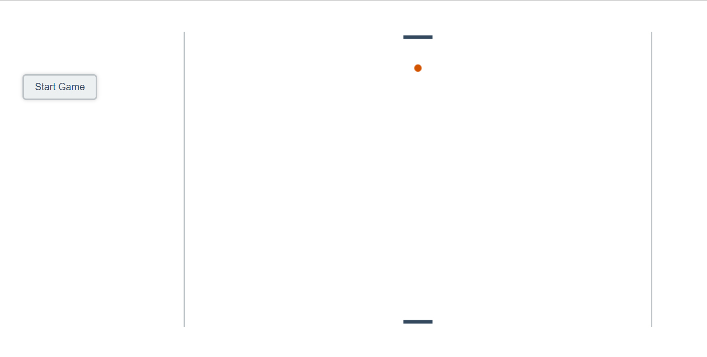
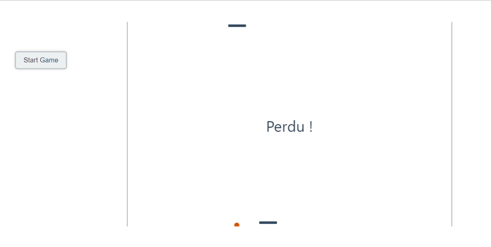

# Pong Game 🏓

**<h3 align="center">Try this pong game at [https://d-roduit.github.io/pong-game/index.html](https://d-roduit.github.io/pong-game/index.html) !</h3>**

## A fun experiment
I created this very simple pong game when I had free time in the public transport.

The main goal was to experiment and play with the HTML5 canvas features.

This game was not completely finished at the time I stopped developing it to devote myself to other more important real projects.

I still wish to make it work like a real basic pong should work and add it a multiplayer mode though.

Anyway, **have fun** playing with the dumb opponent player ! ✌️

## Screenshots

Pong Game while playing

Pong Game when player has lost

## How to play ? 🎮

This game is played on the **keyboard only**.

To move your bar, use the arrow keys (right / left).

Your player bar is the one at the bottom.
